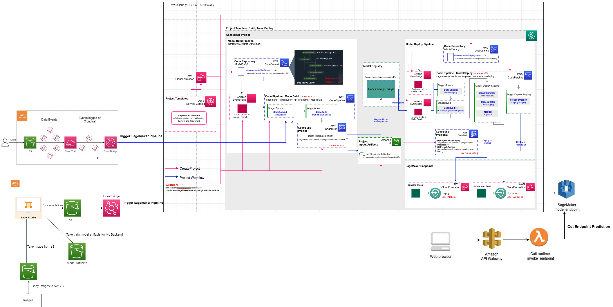

# TSAI EMLOv2 Capstone Project

## Table of Contents
1. [MLOps-Hyperparameter-Tuning](https://github.com/sushantproject/MLOps-Hyperparameter-Tuning)
2. [Model-Evaluation-And-Explanation](https://github.com/sushantproject/Model-Evaluation-And-Explanation)
3. [Sagemaker-Pipeline](https://github.com/sushantproject/Sagemaker-Pipeline)
4. [CI-CD-Pipeline](https://github.com/sushantproject/CI-CD-Pipeline)
5. [Label-Studio-Ml-Backend ](https://github.com/sushantproject/Label-Studio-Ml-Backend)
6. [Project Frontend](https://github.com/sushantproject/EMLOv2-Project-Frontend)

**Complete end-to-end architecture**

**If you want to download this image, click [here](images/tsai_emlov2-project_file.drawio.png)**

### Video Demonstration
* Entire Project Workflow: [Gdrive link](https://drive.google.com/file/d/1WgXm1qwrqGQpO4_H-PpOJL6WBsX4WhjP/view?usp=share_link)
* Label Studio Backend: [Gdrive Link](https://drive.google.com/file/d/1F7l47-HPptjWa5H0E1oKo2iWEn0yKygf/view?usp=share_link)
* Model Inference Detection: [Gdrive Link](https://drive.google.com/file/d/1Nxsgok8iIMe9uiuR2pLVxmmKrt-JsBnm/view?usp=share_link)
* Sagemaker Project Overview: [Gdrive Link](https://drive.google.com/file/d/1XhCgBCeFZngyJ7t0YOMktdt_TtdmA-TK/view?usp=share_link)
